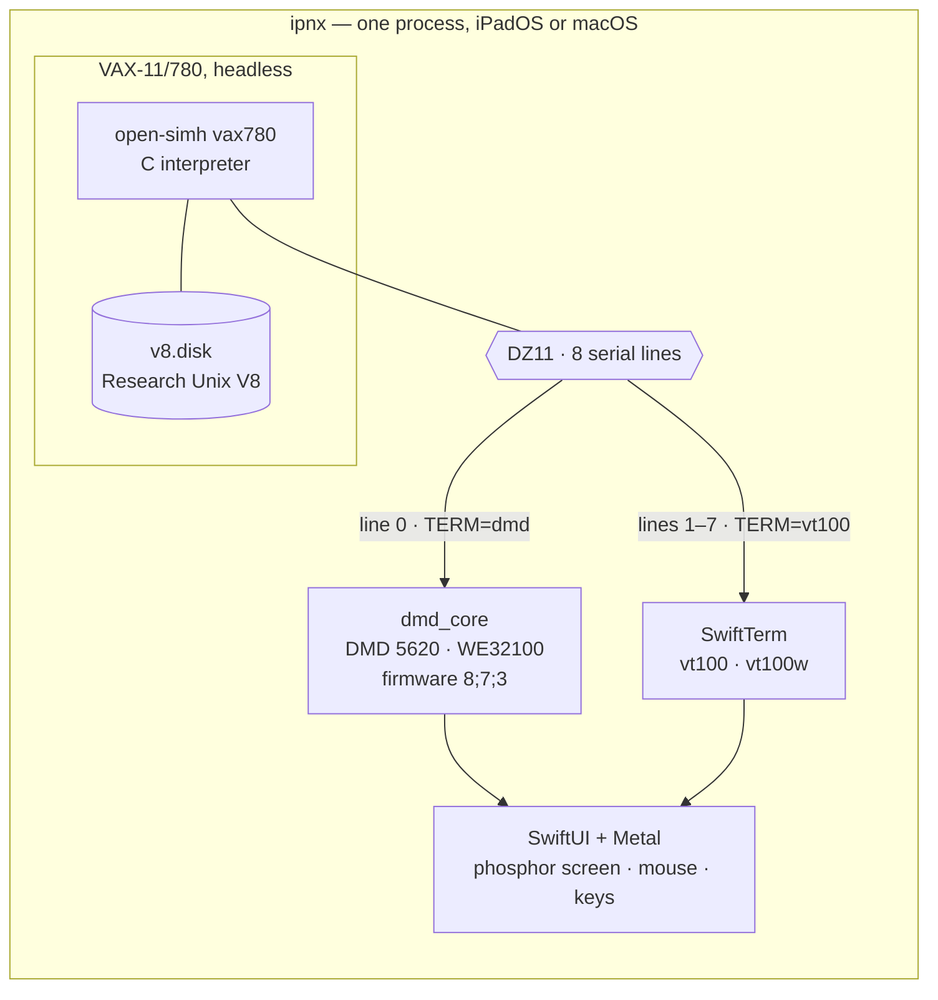

<p align="center">
  
</p>

<h1 align="center">ipnx</h1>

<p align="center"><em>iPad is not Unix. Intellectual Property is not Unix.<br>
Bell Labs Research Unix, booted and carried forward.</em></p>

**Research Unix, restored and running.** Genuine Bell Labs Research Unix — Eighth Edition
today, Tenth Edition as the destination — booted on an emulated VAX-11/780 inside a native
**iPadOS and macOS** app, and displayed the way it was meant to be seen: through an emulated
**DMD 5620** terminal, complete with `mux` layers, a three-button mouse, and eventually `sam`.

The goal is not a shell prompt that looks old. It is to reproduce the original Research Unix
environments *faithfully* — the real kernel, the real terminal, the real wire between them —
on hardware you already carry.

> **Status (2026-08-16): `ipnx Edition 8 Release 1.0`.** The app is real, it works, and the disk it
> ships is **built from this repository's own source** rather than inherited. V8 boots to
> `login:` with save/restore instant-on; `mux` and `jim` run on the 5620 on both iPad and
> Mac; the machine knows its own name, brings its network up at boot, mounts your Mac
> folders at `/n/macos` and `/n/home`, and logs you in on first run as an account named
> after your host login — not as root. It reaches the real Internet: `dnsq` resolves
> names over UDP and `telnet` opens a TCP stream to a live web server. The interface is
> the machine as it actually is — the operator console plus a getty on `tty00`..`tty07`,
> each one openable, in windows grouped by terminal shape. The Mac app is Developer ID
> signed and notarised.
>
> Track A is complete through A5 and Track S built the shipped disk. **Track B — the V10
> restoration — now builds itself**: a Tenth Edition compiler, assembler and libc first ran
> on the Eighth Edition machine, and V10 has since built its own libc, its own `/bin`, and
> **its own kernel** — the first V10 kernel anyone has compiled. A golden boots to a login
> prompt and halts cleanly. Next is the build system itself, redesigned:
> [docs/v10-build.md](docs/v10-build.md). Details: [docs/roadmap.md](docs/roadmap.md).
>
> The two numbers belong to two different people: the **edition** is Bell Labs' and is
> not ours to increment; the **release** counts what this project has made of it, and
> starts at 1.0 because the disk is now built from source rather than patched out of the
> tape ([docs/releases.md](docs/releases.md), [v8/CHANGELOG.md](v8/CHANGELOG.md)).

## The name

**ipnx** began as *iPad is not Unix* — in the recursive-acronym tradition of GNU's Not Unix,
and also a plain statement of fact, since "UNIX" is a registered trademark of The Open Group
and an app that runs Research Unix may not call itself one.

It has a second reading, and that is the one that matters: **Intellectual Property is not
Unix.**

Unix spread in the 1970s *because* a 1956 consent decree kept AT&T out of the computer
business — so the system went out to universities with its source for a nominal fee, and a
generation learned to program by reading it. The 1984 divestiture lifted that restriction,
and what followed is the sordid part: System V against BSD, Unix International against the
Open Software Foundation, *USL v. BSDi*, the sale to Novell, the trademark parked at X/Open,
and finally the SCO litigation grinding through the 2000s over copyrights the courts
eventually found SCO had never owned. Unix the *idea* won completely. Unix the *property*
was carved up among companies that, for the most part, no longer make operating systems.

Meanwhile the actual research carried on quietly at the same lab, on the same machines.
Editions 8, 9 and 10 (1985–1989) were never released outside Bell Labs. `/proc`, the stream
I/O system, the file system switch and a network file system all appeared there first — and
then the same people wrote Plan 9. The line didn't stop because it was finished. It stopped
because the company that owned it had become a different kind of company.

The code came back on 7 March 2017, when Alcatel-Lucent/Nokia stated it would not assert
copyright against non-commercial use of Editions 8, 9 and 10. ipnx is what that permission
is *for*: not a museum piece behind glass, but Bell Labs Unix booted, usable, and carried
forward into a world that never got to have it.

### The plate

The icon is the argument in one picture. In 1980 Bill Shannon, a DEC engineer, put a New
Hampshire vanity plate reading **UNIX** on his Datsun 280ZX. His colleague Armando Stettner
— who would go on to lead Ultrix, DEC's own VAX Unix — needed a giveaway for a USENIX
conference, had 3,000 replicas printed, and they went instantly. The state motto stamped
along the bottom was the whole joke: he thought *Live Free or Die* fitted, in his words,
["the minimalistic and libertarian orientation of UNIX"][plate]. The real plate later passed
to Jon "maddog" Hall, who kept it for twenty years.

It reads differently now, which is why it is here. The system whose badge said *live free*
spent the next thirty years as an asset on a balance sheet, and Editions 8 to 10 sat
unreleased through all of it. Ours is a **stylised** plate — no state, no seal, no
registration, our own proportions — and it says `ipnx`.

[plate]: https://www.unix.org/license-plate.html

## Why full-system emulation

[iSH](https://github.com/ish-app/ish) proved an entire Unix userland can live inside one iOS
app. ipnx takes a different route to a more historic destination: instead of user-mode
syscall translation, it runs **the whole machine** — a VAX-11/780 booting an unmodified
Research Unix kernel, with the screen acting as the portrait CRT of a DMD 5620 connected over
a virtual serial line.

That choice dissolves the platform problems before they start. iOS forbids third-party apps
from spawning processes (no fork/exec) and from generating code at runtime (no JIT). A
full-system emulator needs neither: the Research Unix kernel forks its processes *inside* the
emulated VAX, and both emulator cores are plain ahead-of-time-compiled interpreters — the
same App Store-approved pattern as UTM SE, iDOS 3, and the SIMH-lineage iAltair (on the store
since 2009).

The historically faithful part is that the Blit system genuinely *was* a distributed window
system: a smart terminal running programs downloaded from a headless host over one RS-232
line. The app is simply those two computers and the wire between them.

## Architecture



Two interpreters and a wire, mirroring the real 1985 topology. The app shell is deliberately
**edition-agnostic**: it knows about *machines* (a simulator + a disk image + a wiring), not
about editions, so a future V10 arrives as just another image. Full detail in
[docs/architecture.md](docs/architecture.md); the evidence behind every decision is in
[RESEARCH.md](RESEARCH.md).

## The editions

### ipnx-v8 — Eighth Edition (1985) · *shipping*

The current iteration, and the one that boots today. V8 is the first of the Research editions
to feel modern: `/proc`, Ritchie's streams, the file system switch, Weinberger's network file
system, and the Blit/5620 terminal the whole graphical experience depends on. The app runs it
with save/restore, a real 5620 with two screen sizes, plain glass ttys for quick sessions,
and — since the N track — a working TCP/IP stack reaching the outside world.

The network file system is the part worth pausing on. Weinberger's **netfs** client has been
compiled into every V8 kernel since 1985 and has had nothing to talk to since Datakit was
switched off; ipnx gives it a server again, so **a macOS folder is mounted inside Research
Unix, read/write**, at `/n/macos` and `/n/home`. It needs no port forwarding and works
inside the iOS sandbox, because SLiRP aliases the guest's view of the host to loopback.

### ipnx-v10 — Tenth Edition (1989) · *the restoration*

Tenth Edition **has never been booted by anyone** — there is no boot media, and making
some is the whole of Track B. The plan was to cross-build V10's toolchain on the running
V8; it turned out not to need one. The surviving tarball is not source-only, as everyone
including this project believed: it carries **483 linked VAX executables**, among them
V10's C compiler, its assembler and a complete `libc.a` — and on 2026-08-16 those
**ran unmodified on the V8 kernel**, 9 checks out of 9. Only `cpp`, `c2` and `ld` had to
be built from source, and V10's own `ld` was there all along in a file the plan said did
not exist.

V8 hosted that toolchain long enough for V10 to take over from it, and **V10 now builds
itself.** In the week to 2026-08-24 it built its own `/bin` under `mk`, then a bootable root
carrying the build system on the disk, then a golden that boots to a login prompt and halts
cleanly, then its own `libc`, then **its own kernel**. On 2026-08-25 the whole `world` target
completes — toolchain, libraries, commands, packages, kernel — with the pascal compiler the
last package to fall.

The build is two files the machine reads, both edited in this repository at
`v10/usr/src/build`: an **`mkfile`** with one rule per product, and a **`patch`** script of
idempotent source repairs run before anything compiles. Every deviation from the tape is a
block in `patch` with the evidence beside it, and
`python3 tools/v10-tree.py` prints every file we have changed since the tapes.
[docs/v10-bootstrap.md](docs/v10-bootstrap.md) is how it works today,
[docs/v10-build.md](docs/v10-build.md) is where it is going, the restoration narrative is
[docs/v10-restoration.md](docs/v10-restoration.md), and the lab notebook is
[docs/v10-log/](docs/v10-log/).

**And there was never a pure Tenth Edition to restore.** This is the track's most
important finding (2026-08-17), and it came out of the tape's own `ar` headers rather than
from any history: V10 was not built and shipped, it was **hand-built on each machine by
upgrading V9 in place**. The tarball is one machine's working tree caught mid-migration,
not a release. `libc.a`'s 261 members are dated across **4.1 years and 27 separate days**
— 199 from a single June 1989 build, the rest recompiled in ones and twos until 1993 —
and it is the *old* members we cannot reproduce, because they are V9's and the V9 VAX
compiler is not on the tape. The tooling says the same thing out loud: lcc's back end is
`gen2/vax-v9`, its driver defines `-DV9`, libc's makefile defines `-DV10`, and `iolib.h`
has branches for *V10 without stdarg*, *pANS* and *SGI* but none for a V10 VAX — so nine
`printf` members compile under neither of the tree's two compilers. Neither compiler can
build libc alone: `cc` fails 15 of 261, `lcc` fails 59, because the port was left
half-done.

So **ipnx's V10 is a reconstruction, and labelled as one.** It cannot correspond to a real
V10 machine, because no two real V10 machines corresponded to each other either — each was
its own hand-upgrade. What it can be faithful to is *this tree*, with every deviation
named. V9 is still skipped as a build target — what survives of it is a Sun-3 port with no
VAX kernel — but we now stand on top of it without a copy of it.

### ipnx-v11 — the edition that never was · *speculative*

There is no Eleventh Edition. There could have been: the Research line was visibly heading
somewhere, and the people who would have written it went off and wrote **Plan 9** and later
**Inferno** instead.

ipnx-v11 is the idea of finishing that sentence. The inspiration is
[Plan 9 from User Space](https://9fans.github.io/plan9port/), which brought Plan 9's tools
*forward* to modern Unix; this runs the same trick *backward*, to the system they grew out
of — plus whatever 4.3/4.4BSD had that is genuinely worth having, the games above all.

The admission rule is one question: **does this change the system's model of itself?**
Sockets and vnodes do — V8 answered those questions with streams and the file system switch,
and swapping the answers would just produce another BSD. `snake` does not. Take programs,
refuse personality.

Reading V10's own source tree turned out to reframe the whole idea. It contains
`cmd/u9fs/` — **a Plan 9 file server, speaking the original 9P** (`Tclone`, `Tclwalk`,
`NAMELEN` 28, DES tickets) — along with `mk`, and a netfs deliberately built to take any
protocol library. The Research machines were serving files to the Plan 9 machines down the
corridor. So most of v11 is **restoration rather than importation**, which is both cheaper
and much more defensible. Scope, evidence and the open questions:
[docs/v11-plan.md](docs/v11-plan.md).

## Where this project ends

**ipnx terminates at the Eleventh Edition.** There will be no v12 here. The work that would
have been a twelfth edition is a different project with a different premise, and it lives at
[**ipnx-v12**](https://github.com/ChristineTham/ipnx-v12).

The break is clean rather than gradual, and it is worth setting out why, because the
reasoning arrived in an order nobody would have predicted.

A twelfth edition was first imagined as the most traditional act in this repository:
Research Unix **retargeted**. The kernel still knows how — `sys/md/` holds machine-dependent
code per machine, `sys/ml/` holds the assembler, and a new architecture means a new `md`, a
new `ml`, and in principle nothing else. Ritchie and Johnson crossed that boundary to the
Interdata and proved Unix portable at all; London and Reiser crossed it to the VAX; Norman
Wilson took V8 to a Cray.

Then we counted what would actually survive the crossing, against a target with no MMU and a
memory model nothing in 1989 anticipated:

| Subsystem | Lines | Fate |
|---|---|---|
| `io/` — 60 driver files | 27,035 | Gone. No hardware to drive |
| `vm/` — demand paging | 5,882 | Gone. The runtime is the MMU |
| `md/` — per-machine | 8,116 | Gone. There is no machine |
| `ml/` — `swtch.s`, `trap.s`, `setjmp.s` | 3,141 asm | Gone. No registers to save |
| `os/` process semantics | ~3,300 | The only part with anything left to say |

Three thousand surviving lines out of sixty-four thousand is not a port. It is a rewrite —
and a rewrite is not a restoration, which is the one thing this repository is.

Worse, the kernel worth writing already exists, and it is not this one. Plan 9 has
per-process namespaces, 9P and `rfork` **by design**, where V10's mount lives on
`struct inode` as a pair of pointers in a *global* table. Adding Unix semantics to Plan 9 is
addition; adding Plan 9 semantics to Unix is eviction. So the honest twelfth edition is a
modified Plan 9 kernel hosted as an ordinary userspace process, carrying a V10 personality,
with WebAssembly as the executable format — no VAX, no disk image, no emulator.

At which point it is not this project. Every sentence at the top of this README stops being
true: not full-system emulation, not a real kernel on real emulated hardware, not the
machine as it actually was. Continuing under the same name would quietly repeal the promise
rather than keep it, so it goes somewhere else and says so plainly.

**What stays here is finished work, not abandoned work.** V8 ships. V10 is a restoration
with a golden disk built from this repository's own source. V11 is scoped, small, and
entirely in the old tradition: V10's kernel unchanged, the anachronisms out, the language
settled on ANSI C, a ports format, and what the tree lost brought back —
[docs/v11-plan.md](docs/v11-plan.md).

## ipnx-ports

*Planned; nothing built yet.*

A subproject in this repository, in the spirit of the **FreeBSD ports tree**: a per-package
recipe — upstream distfile, patch series, build and install rules — for bringing contemporary
software back to a machine from 1985.

This is harder than a normal port and interesting for exactly that reason — though measuring
it made it less harsh than expected. V8's libc already has `strchr`, `memcpy`, `memset`,
`qsort` and a `string.h`; what it lacks is `strtol`, `strtod`, `memmove`, `vfprintf` and,
oddly, `bcopy`. **The real wall is the compiler**: V8's 1985 `cc` will not take a prototype,
so a port is largely a K&R rewrite. V10 may not have that problem at all — its tree ships
`lcc`, an ANSI compiler, with a VAX back end. So a port is not a build script but a
documented act of translation, with the patch series as the artifact, and 14-byte filenames
as the constraint that never goes away.

The first entries won't be ports at all. V10's `games/` holds a dozen — `adv`, `boggle`,
`doctor`, `pacman`, `rain`, `trek` — that V8 simply lacks, in the same copyright estate and
built by the same compiler: intra-family transfers that let the machinery get debugged on
work that can't fail for interesting reasons. Then the genuinely absent BSD games (`robots`,
`worms`, `cribbage`, `battlestar`), taken from 4.4BSD-Lite provenance rather than 4.3BSD so
the AT&T question never arises. The one to aim at is **`hunt`** — real-time multiplayer over
a network, which turns the N track's `il0` interface into something you can actually play.
`rogue` needs no porting at all: V8 ships three versions of it, plus **`rogomatic`**, the
program that plays it.

The languages tell the same story. Berkeley Pascal is already complete in V10
(`pi`, `px`, `pxp`, `libpc`, and Berkeley's own error-recovering `eyacc`); Fortran is there
as Feldman's `f77` with `libF77`/`libI77`; so are `hoc`, `icon`, `sml`, `spitbol` and
`matlab`. None of those is a port — they are builds. **Franz Lisp** is the genuine one:
`man/mana/lisp.1` documents `lisp`, `liszt` and `lxref` running on *alice*, a real Bell Labs
machine, but the source is not in the tree — and being VAX-native, it fits this hardware
better than almost anything else from its decade. **S** is the painful one. Chambers,
Becker and Wilks wrote it here, it belongs here, and an exclusive licence in 1993 took it
to StatSci, then Insightful, then TIBCO. It is the only thing this repository names that is
out of reach for reasons that have nothing to do with engineering.

## Where things stand

| Track | | |
|---|---|---|
| **A0** desktop spike | ✅ | Whole chain proven on a Mac before any Swift ran — [spike-a0-results.md](docs/spike-a0-results.md) |
| **A1** text mode | ✅ | open-simh as a library; V8 to `login:` in ~25–30 s; background save/restore — [a1-notes.md](docs/a1-notes.md) |
| **A2** the Blit experience | ✅ | dmd_core on iOS, Metal phosphor screen, touch-as-mouse; `mux` + `jim` end to end — [a2-notes.md](docs/a2-notes.md) |
| **A3** ship v1 | ✅ | Settings, media management, licences, App Store prep — **plus a native Mac app** sharing every line of code — [a3-notes.md](docs/a3-notes.md) |
| **A4** the screen | ✅ | Two fixed CRT sizes incl. 1152×1024/127 columns, Retina-correct sampling, screen *and* session survive a quit — [screen-size.md](docs/screen-size.md) |
| **A5** the interface | ✅ | Nine sessions in windows grouped by terminal shape; every DZ line its own port, so a tab labelled `tty03` *is* `tty03` — [ui-redesign.md](docs/ui-redesign.md) |
| **S** the world build | ✅ | The shipped disk is **built from this repo's V8 source** — toolchain fixpoint, libraries, commands, kernel, and a disk that rebuilds itself — [build-from-source.md](docs/build-from-source.md) |
| **B0** ingest path | ✅ | Host↔guest file transfer proven both ways — [media-exchange.md](docs/media-exchange.md) |
| **B0.5** the N track | ✅ | N0–N7: RP07 disk, an Interlan NI1010 modelled for SIMH, **V8 on the Internet**, and **a macOS folder mounted read/write inside V8** over Weinberger's netfs — [n-track-notes.md](docs/n-track-notes.md) |
| **B0.6** a machine to live in | ✅ | Identity, network up at boot, an account named after the host user, host shares at `/n/macos` and `/n/home` — [machine-config.md](docs/machine-config.md) |
| **B1** V10 toolchain | ✅ | V10's own compiler, assembler and libc are **in the tarball as linked binaries** and **run on the V8 kernel**; `cpp`, `c2` and `ld` built from source. 9/9 and 10/10 — [v10-log/2026-08-16.md](docs/v10-log/2026-08-16.md) |
| **B2** the userland | ✅ | V10 builds its own `libc` and its own `/bin` under `mk`, and as of 2026-08-25 the whole `world` target completes — toolchain, libraries, commands, packages — [v10-bootstrap.md](docs/v10-bootstrap.md) |
| **B3** kernel + first boot | ✅ | **A V10 kernel has been compiled** — by V10, from `usr/sys`, the tape's own way — and a golden boots to a login prompt and halts cleanly with netfs surviving it |
| **B3.5** the build, redesigned | ○ | One tool, three archives, one source tree: `installed` deleted for real dependencies, `/usr/src` as the unit, `mk` everywhere — **next**, [v10-build.md](docs/v10-build.md) |
| **B4–B5** the experience | ○ | Multi-user, `mux`, **`sam`**, then "Edition 10" in the app |
| **C** ipnx-ports | ○ | Ports tree; `libcompat` first, then V10's games, then BSD's |
| **D** ipnx-v11 | ○ | Mostly restoration — V10 already ships a 9P server — [v11-plan.md](docs/v11-plan.md) |
| — | ○ | App Store submission (needs the Apple account) — [app-store.md](docs/app-store.md) |

## Repository map

| Path | What it is |
|---|---|
| [app/](app) | The ipnx app — one Swift/SwiftUI source folder, two targets (iPad, Mac) |
| [libsimh/](libsimh) | open-simh `vax780` packaged as an xcframework, with our patches (idling, the NI1010) |
| [libdmd/](libdmd) | dmd_core packaged as an xcframework, with its patches (BREAK, screen size) |
| [tools/](tools) | Probes, harnesses and build helpers — most of them exist because something lied to us once |
| `work/` | Gitignored workbench: disk images, TUHS tarballs, upstream checkouts |
| `ports/` | *(planned)* the ipnx-ports tree |
| [RESEARCH.md](RESEARCH.md) | The original feasibility study — frozen evidence, not a living doc |
| [docs/architecture.md](docs/architecture.md) | Living technical spec |
| [docs/v10-bootstrap.md](docs/v10-bootstrap.md) | How a Tenth Edition disk is built today |
| [docs/v10-build.md](docs/v10-build.md) | The build system redesign, and the plan to get there |
| [docs/roadmap.md](docs/roadmap.md) | Phases and status for both tracks |
| [docs/licensing.md](docs/licensing.md) | Binding licensing posture for every component |
| [CLAUDE.md](CLAUDE.md) | Working context for AI-assisted sessions — including the hard-won gotchas |

*(The repository was called `ipad-v8` until 2026-08-16, from before the scope grew past one
device and one edition. GitHub redirects the old URL, but the remote is worth updating.)*

## Building and running

Two emulator cores are built as xcframeworks first, then the app. The disk the app embeds
is **built from this repository's own V8 source** and committed in compressed form, so a
fresh clone needs no external media and no workbench:

```bash
tar -xSjf image/ipnx-v8-rp07.img.tar.bz2 -C work/myv8   # -> work/myv8/ipnx-v8-rp07.img
```

That is the app build's only media prerequisite. To rebuild the disk from source rather
than unpack it — and for what proves it complete — see
[docs/golden-disk.md](docs/golden-disk.md); the original desktop spike is described in
[docs/spike-a0.md](docs/spike-a0.md).

```bash
libsimh/build-xcframework.sh
```

```bash
libdmd/build-xcframework.sh
```

```bash
cd app && xcodebuild -project ipnx.xcodeproj -scheme ipnx -destination 'platform=iOS Simulator,name=iPad Pro 13-inch (M5)' build
```

```bash
cd app && xcodebuild -project ipnx.xcodeproj -scheme ipnxMac -destination 'platform=macOS,arch=arm64' build
```

To exercise the whole machine protocol — boot, suspend, save, restore — without the app:

```bash
bash work/verify-libcli.sh
```

### Checking it

The build embeds the golden's sha256 beside the image, and the app replaces its working
copy whenever the two differ — so a rebuilt disk reaches the running machine rather than
waiting for a Reset. This asserts that whole chain, and a Stop hook runs it:

```bash
tools/app-check.sh --full
```

The network self-test builds the netfs server, serves a share, and drives the guest through
TCP to the host, TCP to a real web server, and DNS — asserting **traffic**, not files, since
a machine with every daemon running and every config correct can still pass no packets:

```bash
bash tools/net-selftest.sh rp07new
```

Every guest harness sources `tools/v8drive.exp`, which matches output **markers** rather
than shell prompts — a prompt repeats, and the tty echoes what you type into whatever is
already printing, so prompt-matching drivers silently run one command out of phase. Run
them against a clone, never the golden: booting a disk mounts it, and mounting rewrites the
superblock.

```bash
cp -c work/myv8/rp07new work/myv8/rp07test && expect tools/boot-newdisk.exp rp07test
```

## Licensing

Original content in this repository is MIT-licensed ([LICENSE](LICENSE)). The historical
software it runs is **not** covered by that licence: Research Unix Editions 8–10 are
distributable under Nokia/Alcatel-Lucent's 2017 statement permitting **non-commercial** use.
Three consequences are binding, not stylistic — the app is **free**, with no ads and no
purchases; "UNIX" does not appear in its name; and the disk images ship inside the app so it
stays self-contained. The full component table, and a precise account of how far we read
AT&T's GPL-released 5620 ROM source, is in [docs/licensing.md](docs/licensing.md).

## The people

This project is a homage, so it should name the people it is a homage *to* — not just the
two everyone can name. The Research Unix group was never on an organisation chart; it
coalesced voluntarily, and the manual's own convention was to attribute programs to
individuals so that questions went to the right desk. That convention is worth keeping.

The attributions below follow Doug McIlroy's
[*A Research Unix Reader*](https://www.cs.dartmouth.edu/~doug/reader.pdf), which remains
the authoritative account of who did what. Any errors in compressing it are mine.

### The foundation

- **Ken Thompson** — built the system from the ground up, on a file system model worked out
  with Ritchie and Canaday. Processors for B, `bas` and Fortran; the first shell and piles
  of utilities with Ritchie — `ed`, `roff`, `sort`, `grep`, `uniq`, `plot`, `sa`, `dd`.
  Also circuit-optimising tools, switching and network code, C compilers, and Belle.
- **Dennis M. Ritchie** — the father of C; `fork`/`exec` and set-user-id; the first debugger
  `db` and the definitive `ed`; the **stream** basis for I/O in V8 that this project depends
  on; much of the networking. Made Unix portable with Steve Johnson.
- **Rudd H. Canaday** — the file system model itself, worked out with Thompson and Ritchie.
- **M. Douglas McIlroy** — pipes, and the department head who muscled in on the original
  two-user PDP-7. `tmg`, `speak`, `diff`, `join`, `tr`; and the dictionaries with the tools
  to use them — `look`, `dict`, `spell`.
- **Joseph F. Ossanna** — equipped the first lab and drew the first outside users; `wc`;
  and `nroff`/`troff`, which shaped Unix typesetting permanently.
- **Robert Morris** — wherever mathematics was involved: `typo`, `dc`/`bc` with Cherry, most
  of the math library, `primes` and `factor` with Thompson, and the `crypt` series that gave
  the Center its lasting interest in cryptography.
- **Lorinda L. Cherry** — `dc`/`bc` and `typo` with Morris; initiated `eqn`; invented
  `parts`, the approximate parser behind the Writer's Workbench.
- **Stephen C. Johnson** — `yacc`, which turned Aho's language theory into practice; the
  portable C compiler that ported the system itself; the first `spell`; computer algebra;
  VLSI layout languages.
- **Alfred V. Aho** — the language theory and algorithms underneath `yacc`, `lex`, `cc`, the
  Writer's Workbench and `sam`; and his own `awk`, `egrep`, `fgrep`.
- **Lee E. McMahon** — `comm`, `qsort`, `sed`, the current `grep`, and the concordance
  builders `index` and `cref`; later the prime software architect for Datakit.
- **Brian W. Kernighan** — coined the name UNIX, popularised the tools philosophy, wrote the
  best tutorials, and invented little languages prolifically: `ratfor`, `eqn`, `awk`, `pic`.
  Produced device-independent `troff` after Ossanna's death.
- **Stephen R. Bourne** — `adb` and the Bourne shell, both written in a C that looked
  distinctly like Algol 68.
- **Michael E. Lesk** — made formatting usable by everyone with the `-ms` macros, then
  `tbl` and `refer`; `lex`; and **`uucp`**, which begat a global network. With Ruby Jane
  Elliott, on-line phone books, `apnews`, `weather`; `learn` with Kernighan.
- **Stuart I. Feldman** — `make`, and the `f77` Fortran compiler single-handedly; the `efl`
  preprocessor with **Andrew D. Hall**. His Fortran is still in the V10 tree this project
  builds from.
- **Peter J. Weinberger** — the W of `awk`; f77's I/O library; `mp`, `qfactor`, the B-tree
  library `cbt`, a new C code generator; and above all the **network file system** that
  bound the lab's machines into one logical system.
- **A. G. "Sandy" Fraser** — the Spider ring and the **Datakit** switch, which served the
  lab for over a decade; the Unix Circuit Design System.
- **Joseph H. Condon** — physicist and circuit designer; wire-routing and much of the Circuit
  Design System; Belle with Thompson. Not usually listed as an author of Unix, and
  indispensable to it.
- **Gregory L. Chesson** — computer-to-computer communication in all its forms: `mpx`,
  flow-controlled channels, protocols including uucp's, and Datakit's first software.
- **Charles B. Haley** — the laboratory switching system, with Condon, Morris, Thompson,
  McMahon and Cherry.
- **Brenda S. Baker** — `struct`, which turns Fortran back into Ratfor.

### The Research editions this app runs

- **Bart N. Locanthi** — designed the bitmapped terminal known as jerq, Blit and **Teletype
  DMD 5620** — the machine emulated on screen here — and programmed it too, from `bitblt`
  upward.
- **Rob Pike** — the multiprogramming system, host-terminal protocol, mouse control and
  overlapping virtual terminals: `mpx`, and then **`mux`**, which is what runs when you
  press B3 in this app. Visual editors culminating in **`sam`**; `p`.
- **Thomas J. Killian** — **`/proc`**, the file system of running processes, and so one of
  the ideas that made Plan 9 thinkable; the font editor `jf`; `blitblt`/`thinkblt` and the
  `can` printer suite.
- **David L. Presotto** — tamed networks: `upas` brought order to a Babel of mail addresses,
  and his `ipc` primitives gave Internet, Ethernet and Datakit a common basis.
- **Andrew G. Hume** — `proof`; parts of the Circuit Design System; and **`mk`**, which
  supplanted `make` and which Plan 9 later adopted. It is in V10's `cmd/` with his initials
  on the files.
- **Norman Wilson** — reigning guru alongside Ritchie; ported V8 to a Cray; and waged a
  personal campaign against entropy across the software and the manual, always making things
  shorter. Without him the V8/V9/V10 materials would not exist to be run.
- **William T. Marshall** — Datakit protocol code, with **Gerard Holzmann**, who verified
  those protocols mechanically and later wrote `spin` and `pico`.
- **Christopher J. Van Wyk** — `ideal`, a constraint language for line drawings.
- **Jon L. Bentley** — `grap`, with Kernighan.
- **Bjarne Stroustrup** — C++, whose `cfront` is in the V10 tree.
- **Thomas A. Cargill** — `pi`, the multiview debugger that exercised it.
- **Mark S. Manasse** — `lens` with Pike, and `tek4014`.
- **Luca Cardelli** — an icon builder, `vismon`, and the crabs that eat your screen.
- **Thomas B. London** and **John F. Reiser** — ported V7 to the VAX and introduced paging.
  Their 32V, by way of Berkeley, is the ancestor of nearly every Research Unix since —
  including the one in this app. Reiser also wrote a compile-and-execute `bitblt` for the
  5620.
- **Tom Duff** — `rc`, and Duff's device.

### Keeping it running

- **Berkley A. Tague** — the UNIX Support Group, which guaranteed the system had a future.
- **Richard C. Haight** — `find`, `cpio`, `expr`. **Joseph F. Maranzano** — de facto adjunct
  to the research group. **Theodore A. Dolotta** — did much to refine the manual.
- **Andrew R. Koenig** — `asd`, the automatic software distribution that kept V9 current
  across some fifty machines; `snocone`.
- **Frederick T. Grampp** — computer security, and `quest`.
- **Edward J. Sitar** — kept twenty machines housed, powered and actually working. The
  manual credits him with devotion worthy of Ossanna, and no software at all.

### And afterwards

- **Ken Thompson**, **Rob Pike**, **Dave Presotto**, **Phil Winterbottom**, **Sean Dorward**,
  **Howard Trickey**, **Russ Cox** and others — **Plan 9**, and UTF-8, which is why this
  paragraph renders.
- **John M. Chambers**, **Richard A. Becker** and **Allan R. Wilks** — **S**, the statistical
  language, and so the ancestor of R. It ran on these machines; it is the one thing named in
  this repository that licensing currently puts out of reach.

## Acknowledgements

For making any of it reachable today: **The Unix Heritage Society** (Warren Toomey) for
preserving and hosting the Research Unix archives; **Dan Cross** and **Norman Wilson** for
the V8/V9/V10 materials themselves; **Nokia/Alcatel-Lucent** for the 2017 statement; the
**Plan 9 Foundation** for the 2021 MIT relicensing; **David du Colombier** and **Tim
Newsham** for the V8-on-SIMH recipes; **Seth Morabito** for the DMD 5620 emulator and
firmware preservation; **Dave Dykstra** and AT&T for releasing the 5620 ROM source in 1994;
**Miguel de Icaza** for SwiftTerm; **aiju** and **aap** for the Blit emulators; and the
**open-simh** project.

The list above is certainly incomplete — McIlroy said as much about his own, noting the
borrowings of style and the constant give-and-take that no credits list can capture.
Corrections are welcome and will be made.
