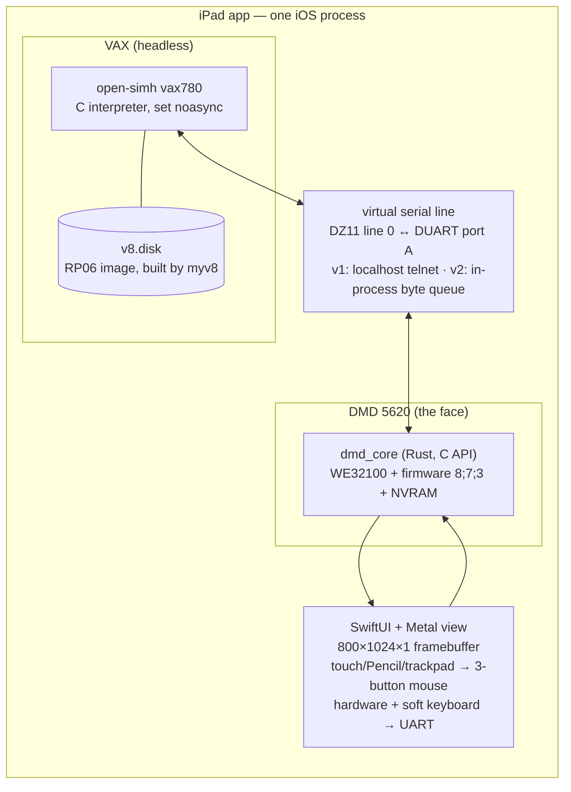

# Research Unix V8 + Blit terminal on iPad — feasibility study

*Researched 2026-08-08. Status: architecture recommended, no code yet. This document is the
synthesis of four parallel research tracks (iOS platform constraints, V8/SIMH, Blit/DMD-5620
emulation, and the WebAssembly route), plus a second round the same day on V9/V10 restoration
state, with primary sources linked throughout. The end goal is **Edition 10**, reached by the
staged path in §7–8.*

## TL;DR — the recommendation

Build a **native iPad app containing two interpreters joined by a virtual serial line**:

1. **open-simh `vax780`** (plain C, MIT) booting a real, unmodified Research Unix V8 disk
   image — full-system emulation, so V8's own kernel handles `fork`, processes, and the MMU
   inside the emulated machine. The iOS "no fork, no exec, no JIT" restrictions never come
   into play.
2. **`dmd_core`** (Rust, MIT, C-compatible API) emulating the **DMD 5620 terminal** — which
   is what V8's window system (`mux`) actually targets. Its 800×1024 portrait 1-bit
   framebuffer becomes the iPad screen; touch/Pencil/trackpad become the 3-button mouse.

**Skip WASM for the app** — it adds a runtime layer that costs performance and buys nothing
(SIMH needs no JIT, so native C is already the fast path). Keep an Emscripten web build as an
optional later phase. **Skip the iSH-style user-mode approach** — it exists to solve a problem
(host integration for Linux apps) this project doesn't have, and it would require
reimplementing the V8 kernel ABI, when the V8 kernel itself is the artifact we want to run.

Every link in the chain is already proven on desktop: V8 boots under SIMH `vax780` (scripted
by [timnewsham/myv8](https://github.com/timnewsham/myv8)), and Seth Morabito's DMD 5620
emulator runs `mux` against V8/V9/V10 today. **The V8 product is integration + iPad UX, not
research.**

**The end goal is Edition 10 — and the road to it runs through V8.** V10 has
**never been booted by anyone** (Warren Toomey's 2017 call for volunteers remains
unanswered) and there is no boot media, so a running V8 under SIMH is the natural host for
building the first bootable one. So V8 is not a detour: it is simultaneously the shippable
v1 image and the machine V10 gets built on. **V9 is skipped entirely** — the surviving V9 is a
Sun-3 port with no VAX kernel code at all, useless to this lineage. Details in §7.

> **Correction, 2026-08-16.** This section and the table in §7 said V10 survives
> as *source only* with *zero binaries*, and described V8's role as a
> **cross-build** machine. Measured against the actual tarball, the first is
> false and the second is therefore too strong. The import
> classifies all 25,682 files by magic number: **483 are linked VAX
> executables**, including the C compiler, the assembler and a complete
> `libc.a` — and a probe showed 9/9 that they run unmodified on
> the V8 kernel. There is no cross-build; V10's own toolchain runs, and only
> `cpp`, `c2` and `ld` had to be built from source. See
> the 2026-08-16 toolchain result. The claim that
> *nobody has booted it* stands, and remains the point of Track B.

---

## 1. The fork question: three candidate architectures

| | User-mode (iSH-style) | **Full-system, native (recommended)** | Full-system, WASM |
|---|---|---|---|
| What's emulated | CPU user mode only; syscalls translated to iOS | Whole VAX: CPU, MMU, disks, serial | Same as native, compiled to wasm |
| `fork` on iOS | Must be faked (threads + software MMU + COW) | Non-issue — V8 kernel forks inside the VM | Non-issue |
| Effort | Enormous: reimplement V8 kernel ABI | Small: two existing interpreters + glue | Native effort + wasm toolchain + browser quirks |
| Authenticity | V8 userland only; kernel (streams, /proc, mux plumbing) lost | Real kernel, real everything | Real kernel |
| Speed on iPad | Fast | ~50–100× a real VAX-11/780 (more than enough) | ~1.5–2.5× slower than native |

**How iSH actually works** (and why we don't need any of it): iSH emulates 32-bit x86 user
mode with a threaded interpreter of precompiled native "gadgets" (no JIT — "not quite a JIT
since it doesn't target machine code", per the [README](https://github.com/ish-app/ish)).
Every emulated Linux process is a **pthread** in the single iOS process; `fork` is
implemented in iSH's own kernel layer with a software MMU doing copy-on-write page tables in
userspace ([kernel/fork.c](https://github.com/ish-app/ish/blob/master/kernel/fork.c),
[kernel/memory.c](https://github.com/ish-app/ish/blob/master/kernel/memory.c)); its `exec`
replaces the current task in place. It is a reimplementation of the Linux kernel ABI. Doing
the equivalent for V8 would mean rewriting the most interesting parts of V8 (streams, `/proc`,
the mux line disciplines) instead of running them.

**Why fork is moot under full-system emulation**: iOS forbids third-party apps from
spawning child processes at all (confirmed by Apple DTS:
["iOS apps are not allowed to spawn child processes"](https://developer.apple.com/forums/thread/747499)).
But a full-system emulator is *one* iOS process running an interpreter loop. When V8 calls
`fork`, that's just the emulated VAX executing instructions that manipulate emulated page
tables. The host OS never knows.

## 2. Is it App Store–legal? Yes, with precedents

- **No JIT needed, so the hardest rule doesn't apply.** `mmap(MAP_JIT)` requires the private
  `dynamic-codesigning` entitlement Apple only grants to system processes
  ([saagarjha's analysis](https://saagarjha.com/blog/2020/02/23/jailed-just-in-time-compilation-on-ios/)).
  SIMH and dmd_core are pure interpreters — they compile ahead-of-time like any app code.
- **Guideline 4.7** (current text): "retro game console **and PC emulator apps** can offer to
  download games" — the PC-emulator wording landed
  [Aug 1, 2024](https://developer.apple.com/news/?id=ty0avr2s). Approved precedents:
  - **UTM SE** (QEMU as a threaded interpreter, no JIT) — rejected June 2024, **approved July
    2024** ([App Store](https://apps.apple.com/us/app/utm-se-retro-pc-emulator/id1564628856)).
    Note QEMU has no VAX target, so UTM can never cover this niche.
  - **iDOS 3** (Aug 2024), **RetroArch/PPSSPP/Delta** (2024), **ArcadeMania/MAME** (2025).
  - **iAltair** — a SIMH-lineage Altair 8800 emulator by the author of SIMH's AltairZ80, on
    the App Store **since 2009** ([listing](https://apps.apple.com/us/app/ialtair/id291182085)).
    Direct precedent for "SIMH machine as a self-contained app".
- **The live risk is 2.5.2** (apps must be self-contained, not download executable code) —
  it's what briefly got iSH threatened in 2020 and got iDOS 2 removed in 2021. Design
  response: ship a **self-contained app with a bundled disk image**; user import of disk
  images via the Files app is the same pattern UTM SE and iDOS 3 use today.

## 3. The V8 software stack (all of it exists)

- **Canonical bits**: TUHS hosts the tapes at
  [Distributions/Research/Dan_Cross_v8/](https://www.tuhs.org/Archive/Distributions/Research/Dan_Cross_v8/) —
  `v8.tar.bz2` (a tar of a running system's root, ~8.6 MB) and `v8jerq.tar.bz2` (terminal
  software). [Alhadis/Research-Unix-v8](https://github.com/Alhadis/Research-Unix-v8) is a
  browsable mirror of both (no images or configs — source tree only).
- **Boot recipe** (community-proven): SIMH **`vax780`** — not the 750; installs use Bell
  Labs' own `alice` VAX-11/780 kernel config (Massbus RP06 disks) — with 4.1BSD installed
  first as the bootstrap base, then V8 restored over it.
  [timnewsham/myv8](https://github.com/timnewsham/myv8) **automates the entire install with
  expect scripts and produces a ready-to-boot `v8.disk`** — that's the app's appliance-image
  build pipeline. Manual walkthrough: [David du Colombier's notes](https://www.9legacy.org/9legacy/doc/simh/v8);
  background: [gunkies](https://gunkies.org/wiki/Unix_Eighth_Edition),
  [virtuallyfun](https://virtuallyfun.com/wordpress/2017/03/30/research-unix-v8/).
- **Known gotchas** (all documented, all config-level):
  - SIMH newer than 3.9 needs **`set noasync`** or V8 gets I/O errors / RP06 corruption
    ([simh#425](https://github.com/simh/simh/issues/425)).
  - Realistic DZ11 serial pacing makes the 5620 program download take **~17 minutes**
    (gunkies). The app must run its virtual serial line unthrottled — see §6.
  - No `/dev` on the tape (`proto-dev` script provided); fstab/ttys/timezone set up by hand —
    myv8 handles this.
- **What you get inside V8**: Ritchie's **streams**, Killian's **/proc**, Datakit support,
  early C++ (`usr/src/cmd/cfront`), and the man9 terminal software. Editors: **`jim`** (the
  mouse-driven editor; `sam` doesn't exist yet — it's V9/V10 era). Terminal programs shipped
  as `.m` binaries: `jim`, `pads`, `proof`, `paint`, `ped`, `cip`, `crabs`, `lens`, and more.
- **Performance**: real VAX-11/780 = 1 VUPS. SIMH delivers ~30–60 VUPS on 2012–2015 x86
  desktops ([simh list benchmarks](https://groups.io/g/simh/topic/my_vups_benchmarks_for_simh/78396730));
  an M-series iPad should land at **roughly 50–100× a real 780** (extrapolation — verify in
  the desktop spike; CPU speed is clearly not the constraint, serial pacing is).

## 4. Terminal choice: DMD 5620 first, 68000 Blit as a stretch goal

A naming surprise from the tape itself: in `v8jerq.tar.bz2`, **`jerq/` is the DMD 5620
(WE32100)** tree — V8's *current, documented* graphics terminal (`intro(9)`: section 9 lists
software for "Teletype DMD-5620 terminals, the current implementation of the 'jerq' graphics
terminals") — while **`blit/` is the original MC68000 Blit**, self-described in its
`Road.map` as a dusty "snapshot … of Dec 10 or thereabouts, 1982". Both are 800×1024×1
portrait displays with a 3-button mouse, connected to the VAX by one RS-232 line.

**Session mechanics** (identical shape for both): log in over the serial line as a dumb
terminal → run **`mux`** → the host downloads the terminal-side window system
(`/usr/jerq/lib/muxterm`) over that same line via **`32ld`** (5620) or `68ld` (Blit) → each
layer (window) is a virtual terminal with its own shell. No special kernel driver needed on
the VAX side — a plain DZ11 line over telnet demonstrably works.

| | **DMD 5620 route (recommended)** | Original 68000 Blit route |
|---|---|---|
| CPU core | [`dmd_core`](https://github.com/dmdmtg/dmd_core) — Rust, **MIT**, C-compatible API since 0.5.0, WE32100 + DUART + NVRAM | [Musashi](https://github.com/kstenerud/Musashi) (C, MIT-terms) or aiju's core in [aap/blit](https://github.com/aap/blit) (unlicensed) |
| Firmware/ROMs | **Embedded in dmd_core** (both 8;7;3 and 8;7;5); AT&T released the ROM *source* under the **GPL in 1994** ([5620rom](https://github.com/dmdmtg/5620rom)) — legally clean | rom0–rom5 circulate in every emulator repo with **no permission statement found** — legally grey |
| Proven against V8? | **Yes** — "works with `mux` on Research UNIX (V8, V9, and V10), so long as the terminal is running firmware **8;7;3**" ([loomcom](https://loomcom.com/3b2/dmd5620-emulator/); [TUHS announcement](https://www.tuhs.org/pipermail/tuhs/2022-September/026445.html), [video](https://www.youtube.com/watch?v=tcSWqBmAMeY)) | Yes — [timnewsham/blit](https://github.com/timnewsham/blit) and [aap/blit](https://github.com/aap/blit) both run V8 `mux` over telnet, with screenshots |
| Software on tape | Fresher, more complete (`jim`, `pads`, full SGS cross-toolchain) | 1982 snapshot, "will only run on Blits with the new PROMs" |

**MAME is a dead end** for both: its `blit` driver is `MACHINE_NOT_WORKING` (fails at
"68ld: load protocol failed"), there is no 5620 driver, and MAME's WE32100 "core" is
explicitly a stub with no execution engine.

Key integration details for dmd_core: it is "completely agnostic about where input characters
come from" (RX/TX byte queues — ideal for embedding); select **firmware 8;7;3** for V8 `mux`;
it models the 8 KB battery-backed NVRAM (persist it in the app container so terminal settings
survive relaunch). Rust builds for `aarch64-apple-ios` as a static library with the C API.

## 5. Why not WASM (and the one place it makes sense)

The iOS platform inverts the usual intuition, but the conclusion is still "native":

- **The only App Store–legal JIT is inside WKWebView** (its WebContent process is an Apple
  system binary with the JIT entitlement; WebKit's wasm pipeline is JIT-tiered
  IPInt→BBQ→OMG). In-process JavaScriptCore has no JIT — and Apple disabled wasm in
  JSContext around iOS 16.4 anyway.
- **But a JIT is only useful if you generate code at runtime — SIMH doesn't.** It's an
  interpreter written in C; compiling that C with clang for arm64 *is* the optimal
  compilation. Putting it through wasm only adds overhead: measured **~1.45–1.55× slowdown**
  for compiled C in browser wasm ([USENIX ATC '19](https://www.usenix.org/conference/atc19/presentation/jangda)).
- **WASM inside a native app is strictly worse**: wasm3-class interpreters are ~**11.8×
  slower than native** by their own benchmarks
  ([wasm3 Performance.md](https://github.com/wasm3/wasm3/blob/main/docs/Performance.md));
  WAMR's AOT mode has open, unresolved issues on physical iOS devices; wasmtime falls back to
  its Pulley interpreter on iOS. Compounded with emulation you'd be ~15–20× off native for
  zero legal benefit — UTM SE proves native interpreters are approved.
- **The web-demo path is real, just not the app.** Open SIMH compiled to wasm and shipped as
  a polished product exists ([web650 — IBM 650 in the browser](https://github.com/jblang/ibm650),
  Feb 2026: SIMH in a WebWorker, OPFS-backed storage). Notably, **no VAX emulator of any kind
  exists in a browser today** (the rumored Nankervis JS VAX does not exist — only his PDP-11
  and PDP-10), and no browser 5620/Blit exists either (aiju's [jsblit](https://github.com/aiju/jsblit)
  is the closest, a 68K Blit needing a WebSocket proxy). A browser V8+5620 would be a genuine
  first — a great post-1.0 demo built from the same C/Rust cores, with known iPad-Safari
  caveats (SharedArrayBuffer needs COOP/COEP; no pointer lock; keyboard-event minefield;
  home-screen PWA storage is a separate container).

## 6. Recommended architecture



- **Serial plumbing, v1**: zero-patch. SIMH attaches the DZ11 as a telnet listener on
  `127.0.0.1` (`set dz lines=8` / `att dz -m 8888` — du Colombier's exact config); a small
  shim connects a local socket and pumps bytes into dmd_core's RX queue (handling telnet IAC
  minimally — this is precisely how timnewsham/blit and aap/blit already work). Localhost
  sockets inside one app are fine on iOS.
- **Serial plumbing, v2 (the 17-minute fix)**: bypass sockets and pacing entirely — patch
  `sim_tmxr` to expose one line as an in-process byte queue, and run it unthrottled. The
  `muxterm` download then takes seconds. (Measure in the desktop spike first; per-line SPEED
  settings may be sufficient without a patch.)
- **Display**: the 5620's framebuffer is a ~100 KB window of its RAM. Blit it to a Metal
  texture (or CGImage) at 60 Hz with dirty-region diffing; 1-bit → any phosphor tint you
  like. 800×1024 portrait maps beautifully onto an iPad held vertically.
- **Input**: iPadOS pointer/trackpad gives real hover + secondary click; map Pencil/touch to
  button 1, two-finger tap or on-screen modifier to buttons 2/3 (mux's layer menu lives on
  button 3). Hardware keyboard passes through; soft keyboard toggles.
- **Persistence**: `v8.disk` copied to the app container on first launch (Files-app
  import/export for power users); dmd_core NVRAM file; SIMH save/restore for instant-on.
- **Console fallback**: a plain VT100 view on the SIMH console line (SwiftTerm is the obvious
  library) — needed for boot diagnostics and single-user work, and it makes Phase 1
  shippable before any graphics exist.

## 7. The end goal: Edition 10 — evaluating the path (staged vs. direct)

The question: get V8 working, then V9, then V10 — or go straight to V10? The evidence
settles it: **staged, but as V8 → V10 with V9 dropped from the sequence.** "Straight to V10"
is not actually on the menu, and V9 contributes nothing to a VAX lineage.

### What survives of each edition

| | V8 | V9 (surviving) | V10 (surviving) |
|---|---|---|---|
| Form | Running-system tar + jerq tape — **restorable** | 1987-vintage **Sun-3 port** snapshot; **no VAX kernel code at all** ([V9 sys tree](https://www.tuhs.org/cgi-bin/utree.pl?file=V9/sys): `3-50`, `3-75`, `sun3` — no VAX dirs) | Snapshot of the post-V10 CSRC tree (~1995): source **plus 483 linked VAX executables, 1,525 objects and a complete `libc.a`** — but **no boot media** (corrected 2026-08-16; this row read "zero binaries") |
| Ever booted? | Yes — turnkey ([myv8](https://github.com/timnewsham/myv8)) | Only on an emulated Sun-3 ([TME, April 2017](https://virtuallyfun.com/2017/04/01/research-unix-v9/), fragile, "disk errors") | **Never, by anyone.** [Toomey's 2017 call for volunteers](https://www.tuhs.org/pipermail/tuhs/2017-April/011079.html) is still open; a 2022 guide judged it "cannot currently be emulated" |
| Userland | Complete running system | ~104 commands; no C compiler source; no man-page sources | **378 commands** (awk, yacc, mk, troff+pic+grap+ideal, upas, lcc 2.0, cfront 2.0), structurally complete libc, full docs |
| Kernel targets | VAX-11/750, 780 | Sun-3 only | 750 (`comet`), 780 (`star`), **MicroVAX II** (`mflow`), MicroVAX III (`mfair`), **VAX 8200** (`bvax`), 8550/8700 (`naut`) — per [`lsys/ml`](https://www.tuhs.org/cgi-bin/utree.pl?file=V10/lsys/ml) and the [boot README](https://www.tuhs.org/cgi-bin/utree.pl?file=V10/lsys/boot/README) |
| 5620/mux stack | `v8jerq` tape | Present (Sun-hosted) | **Complete** (`v10blit` = `/usr/jerq`): `mux`, `32ld`, **`sam` + `samterm`**; `mux.h` byte-identical V9↔V10, only trivial `mux.c` deltas since V8 |
| Role here | **v1 product + V10 build host** | **Skip** | **The destination** |

### Why "straight to V10" isn't possible

V10 ships **no boot media**: the kernel and the 512-byte boot block exist only as source
*written to be built on a Research Unix system*. Someone has to host that first build, and
the only bootable Research VAX system on Earth is V8 under SIMH. The community reached the
same conclusion in 2017
(Warner Losh: ["we need to reconstruct v8, v9 and v10 to varying degrees"](https://www.tuhs.org/pipermail/tuhs/2017-April/011084.html)) —
though nobody has demonstrated it; this would be a **first**.

> **Corrected 2026-08-16.** This paragraph opened *"V10 ships zero binaries: the compiler
> (Research-modified pcc2), assembler, linker, libc, kernel, and even the 512-byte boot
> block all exist only as source"*. The clause about the boot block and kernel is right
> and is the whole reason this section exists. The rest is wrong: the compiler, the
> assembler and libc all ship as **linked VAX binaries**, and they run on V8. Only the
> linker was genuinely absent as a binary — and its source, `cmd/ld.c`, is present too.
> So the conclusion survives and its stated reason does not, which is worth more than
> either: V8 is needed as a *host*, not as a cross-compilation platform. The escape hatch
> that used to end this paragraph — reconstructing pcc2 and the SGS as modern cross-tools
> on macOS — is retired, being strictly more work for a less authentic result now that
> the originals run. Established 2026-08-16.

### Why V9 drops out

The surviving V9 is the wrong architecture (Sun-3), thinner than V8's userland, and booting
it would mean adding a Sun-3 emulator — an entirely different project that advances the VAX
chain by nothing. Its one relevant fact — that `mux` survived essentially unchanged — we
already have via V10.

### The bootstrap chain (Track B)

```
4.1BSD ──(myv8, proven)──▶ V8 on SIMH vax780
  V8 cc builds ──▶ V10 toolchain (pcc2, as, ld)
  pcc2 builds  ──▶ V10 libc + userland      ← reconcile /usr/include skew here
  pcc2 builds  ──▶ V10 kernel + boot block  ← kernel at fs start, ≤ singly indirect
  mkfs + dd    ──▶ v10.disk ──▶ first V10 boot attempt
```

**Machine target**: try **`star` (VAX-11/780) first** — continuity with the app's existing
`vax780` core, and the tree carries real CSRC 780 configs (`alice.m`). Exact-match fallbacks
where both the V10 kernel and SIMH agree: **MicroVAX II** (`microvax2`; the boot README
documents its VMB boot scheme in detail) and **VAX 8200** (Matt Burke's KA820 simulator).
The Labs' own V10 mainline (8550/Nautilus) is *not* emulated by SIMH — one reason to expect
the 780 code path may be stale and to keep the fallbacks warm.

### What V10 buys (the payoff)

**`sam` with `samterm` on the 5620** (the definitive mouse editor experience), `mk`, the new
awk, upas mail, lcc 2.0 and cfront ~2.0, streams-based in-kernel TCP/IP with DEQNA Ethernet
support, /proc evolution, and the full 1990 two-volume manual as documentation. And the
terminal side needs **no new work**: the mux protocol is unchanged and dmd_core explicitly
supports V10 (`8;7;3` firmware, as with V8).

### Known incompleteness of V10 (eyes open)

- `/usr/include` was **missing from both archives**; the patch (`r70include.tar`) is a 1997
  snapshot that "probably is not precisely concordant" with the 1995 source — expect
  header/source skew to surface as compile failures.
- The `rc` shell source is absent (man pages exist; `sh` survives — use it).
- Norman Wilson's own framing: these are ["snapshots, not formal releases"](https://www.tuhs.org/pipermail/tuhs/2017-April/011076.html),
  and making one work needs "a fair amount of hand-waving."
- The native compiler pcc2 carries System III/V-derived code (see §9), and the published
  manual is encumbered as a book.
- Nothing suggests a *hole* in the kernel or libc themselves — the tree is remarkably
  complete; the risk is integration friction, not missing subsystems.

## 8. Roadmap — Track A ships, Track B restores

The two tracks share Phase 0 and the entire app shell; they decouple after that. The app is
image-agnostic, so Track B's output drops in as a selectable machine when it lands.

**Track A — the product (V8 inside; weeks-scale, all steps proven):**
- **A0 — desktop spike (no iOS code).** Run `myv8` to produce `v8.disk`; boot open-simh
  `vax780` on the Mac; connect Morabito's 5620 emulator (firmware 8;7;3); run `mux`. Measure
  the muxterm download time and test unthrottled-DZ settings. *Exit criterion: mux usable;
  serial-pacing fix understood.*
- **A1 — V8 text mode on iPad.** open-simh as a static library (CMake → xcframework),
  `set noasync` baked in, bundled `v8.disk`, SwiftTerm console UI. Boots to `login:`.
- **A2 — the Blit experience.** dmd_core via C FFI (`aarch64-apple-ios` staticlib); Metal
  framebuffer; mouse/keyboard mapping; in-process serial path; `mux` end-to-end on iPad.
- **A3 — ship v1.** Settings, snapshots, disk import/export, licenses screen (statement PDF,
  credits), App Store submission as a **free** app.

**Track B — the V10 restoration (months-scale, genuinely novel; runs on desktop SIMH, not
iPad, until it boots):**
- **B1 — toolchain.** On the running V8: import `v10src` + `v10blit`; build pcc2/as/ld with
  V8's cc; smoke-test by compiling V10 `hello.c` and a mid-size command.
- **B2 — world.** Build V10 libc and core userland; reconcile `r70include` header skew as
  failures appear; keep a patch log (this *is* the publishable artifact).
- **B3 — kernel + first boot.** Build the `star` kernel and 512-byte boot block per
  `lsys/boot/README`; construct the filesystem image (kernel at start, ≤ singly indirect);
  attempt boot on `vax780`; fall back to `microvax2` / `vax8200` if 780 support has rotted.
  Announce progress on TUHS — this is an open 2017 challenge and help is likely.
- **B4 — the V10 experience.** `mux` + `sam`/`samterm` on the 5620 against V10; stabilize;
  produce a distributable `v10.disk`.
- **Merge.** App gains "Edition 10" as a second machine (if the winning target isn't the
  780, embed that SIMH simulator too — SIMH makes additional simulators cheap).

**Post-1.0 (optional).** 68000 Blit mode (Musashi; resolve ROM permissions first).
Emscripten web demo — the first browser VAX.

## 9. Licensing and distribution

The operative text for V8, V9, and V10 alike — one covenant, no per-edition carve-outs (the
2017 Alcatel-Lucent/Nokia statement,
[PDF at TUHS](https://www.tuhs.org/Archive/Distributions/Research/Dan_Cross_v8/statement_regarding_Unix_3-7-17.pdf)):

> "…it will not assert its copyright rights with respect to any **non-commercial** copying,
> distribution, performance, display or creation of derivative works of Research Unix®
> Editions 8, 9, and 10."

It is a covenant not to sue, not a license — and it grants nothing "for commercial purposes."

| Component | License | App implication |
|---|---|---|
| V8 system + disk image | 2017 covenant (non-commercial) | **Free app; no ads/IAP tied to V8 content**; bundle the statement PDF; credit TUHS |
| 4.1BSD-derived kernel bits inside V8 | UCB BSD license | Include UCB attribution |
| V10 source + any built `v10.disk` (Track B) | Same 2017 covenant (titled "Editions 8, 9, and 10") | Same free-app posture as V8 |
| pcc2 — V10's native C compiler | Research-modified **System III/V-derived** code; the covenant is hedged "to the extent of its ability", and SysV rights are third-party | Sharpest open item. Mirror TUHS's posture (publicly distributed since 2017 without challenge); document it; it stays *inside* the disk image, not in app code |
| V10 manual (Saunders, 1990) | Published copyrighted book; Norman Wilson: treat the docs as encumbered | Don't bundle the scans; link out to cat-v/TUHS |
| open-simh | MIT | Clean |
| dmd_core + embedded 5620 firmware | MIT (repo/crates.io); firmware source GPL'd by AT&T, 1994 | Clean. One loomcom *web page* carries a CC BY-NC-SA site notice — almost certainly the blog prose, not the code, but worth a courtesy email to Seth Morabito to confirm |
| Musashi (optional 68K Blit mode) | MIT-terms text in readme (no SPDX file) | Fine; note in credits |
| Original Blit ROMs (optional 68K Blit mode) | **No permission statement found anywhere** | Don't ship until resolved; "bring your own ROM" fallback |
| "UNIX" | Open Group trademark; no rights granted | **Don't put UNIX in the app name** — "V8", "Research Edition 8", "Blit" are safe |

## 10. Risks and open questions

| Risk | Severity | Mitigation |
|---|---|---|
| Serial pacing (17-min muxterm load) | High (UX-defining) | Unthrottled in-process line (§6 v2); verify in A0 |
| `set noasync` requirement / SIMH I/O bugs vs V8 | Medium | Known fix; bake into config; pin an open-simh commit |
| dmd_core needs firmware **8;7;3** for V8 mux | Low | Both ROMs are embedded; select 8;7;3 |
| Battery: emulated CPU spins at 100% when V8 idles | Medium | Investigate SIMH idle detection for V8's 4.1BSD-derived idle loop; worst case, patch the V8 kernel idle or throttle when no I/O |
| App review variance | Medium | Free, fully self-contained, 4.7 precedents (UTM SE, iAltair); avoid 2.5.2 triggers |
| dmd_core license-page ambiguity | Low | Email Seth Morabito; repo LICENSE is MIT |
| 68K Blit ROM legality | Low (optional phase) | Defer; seek permission; BYO-ROM |
| iPad keyboard/pointer quirks | Low (native app) | Native UIKit/SwiftUI input — the Safari-specific minefield doesn't apply |
| **V10 restoration is unprecedented** — nobody has ever booted it | High (Track B schedule only — Track A ships regardless) | Timebox B-phases; announce on TUHS and recruit (the 2017 call is still open); modern-cross-toolchain escape hatch |
| V10 `/usr/include` is a 1997 reconstruction, "probably not precisely concordant" with the 1995 tree | Medium (Track B) | Reconcile per compile failure; keep a patch log |
| V10 boot-block constraints (kernel at fs start, ≤ singly indirect, 512-byte boot) | Medium (Track B) | Follow `lsys/boot/README` exactly; MicroVAX II VMB path is the documented alternative |
| V10's 780 support may be stale (Labs mainline was the 8550, which SIMH lacks) | Medium (Track B) | Exact-match fallbacks: MicroVAX II (`microvax2`), VAX 8200 (`vax8200`) |
| `rc` shell source absent from the V10 tree | Low | Use `sh` (present); note the gap |

## Appendix: primary sources

- **V8 bits**: [TUHS Dan_Cross_v8](https://www.tuhs.org/Archive/Distributions/Research/Dan_Cross_v8/) · [Alhadis mirror](https://github.com/Alhadis/Research-Unix-v8) · [myv8 installer](https://github.com/timnewsham/myv8) · [du Colombier's SIMH notes](https://www.9legacy.org/9legacy/doc/simh/v8) · [gunkies: Unix Eighth Edition](https://gunkies.org/wiki/Unix_Eighth_Edition)
- **Emulators**: [open-simh](https://github.com/open-simh/simh) · [dmd_core](https://github.com/dmdmtg/dmd_core) · [dmd5620 emulator page](https://loomcom.com/3b2/dmd5620-emulator/) · [5620 firmware source](https://github.com/dmdmtg/5620rom) · [timnewsham/blit](https://github.com/timnewsham/blit) · [aap/blit](https://github.com/aap/blit) · [Musashi](https://github.com/kstenerud/Musashi)
- **iOS platform**: [iSH](https://github.com/ish-app/ish) · [Apple DTS on fork](https://developer.apple.com/forums/thread/747499) · [saagarjha on iOS JIT](https://saagarjha.com/blog/2020/02/23/jailed-just-in-time-compilation-on-ios/) · [App Review Guidelines §4.7](https://developer.apple.com/app-store/review/guidelines/) · [UTM SE](https://apps.apple.com/us/app/utm-se-retro-pc-emulator/id1564628856) · [iAltair](https://apps.apple.com/us/app/ialtair/id291182085)
- **WASM reference points**: [web650 (SIMH→wasm product)](https://github.com/jblang/ibm650) · [Not So Fast (ATC '19)](https://www.usenix.org/conference/atc19/presentation/jangda) · [wasm3 performance](https://github.com/wasm3/wasm3/blob/main/docs/Performance.md) · [qemu-wasm](https://github.com/ktock/qemu-wasm)
- **V9/V10**: [TUHS Norman_v9](https://www.tuhs.org/Archive/Distributions/Research/Norman_v9/) · [TUHS Norman_v10](https://www.tuhs.org/Archive/Distributions/Research/Norman_v10/) · [TUHS Dan_Cross_v10](https://www.tuhs.org/Archive/Distributions/Research/Dan_Cross_v10/) · [Alhadis v9 mirror](https://github.com/Alhadis/Research-Unix-v9) · [Alhadis v10 mirror](https://github.com/Alhadis/Research-Unix-v10) (note: mirror omits the `630/` tree — use the TUHS tarball) · [V10 boot-block README](https://www.tuhs.org/cgi-bin/utree.pl?file=V10/lsys/boot/README) · [Toomey's V10 call for volunteers (2017)](https://www.tuhs.org/pipermail/tuhs/2017-April/011079.html) · [Norman Wilson: "snapshots, not formal releases"](https://www.tuhs.org/pipermail/tuhs/2017-April/011076.html) · [V9 booted on TME (virtuallyfun)](https://virtuallyfun.com/2017/04/01/research-unix-v9/)
- **History**: [TUHS 2022 thread — 5620 emulator meets Research Unix (incl. Rob Pike)](https://www.tuhs.org/pipermail/tuhs/2022-September/026463.html) · [Blit (Wikipedia)](https://en.wikipedia.org/wiki/Blit_%28computer_terminal%29)
